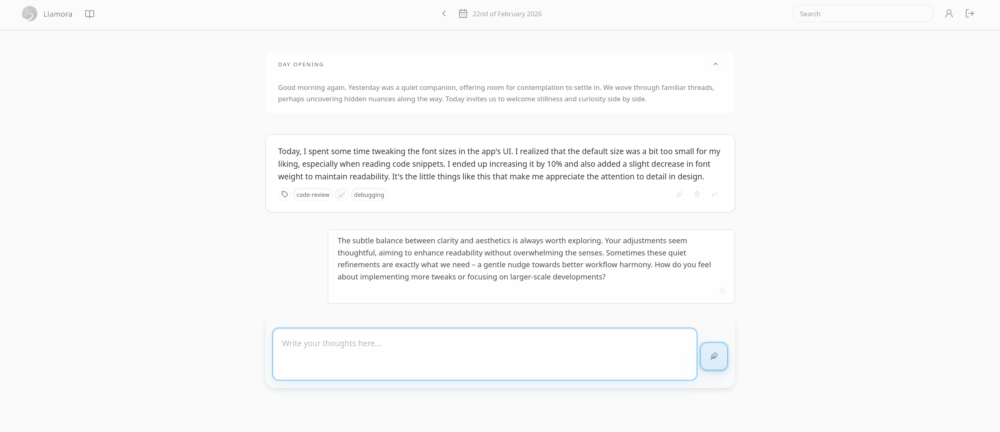
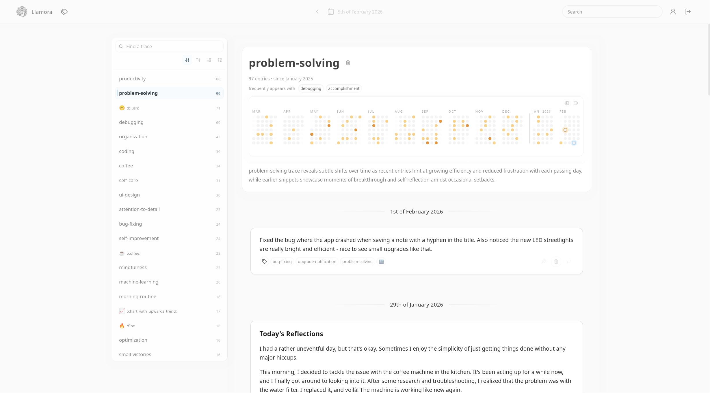
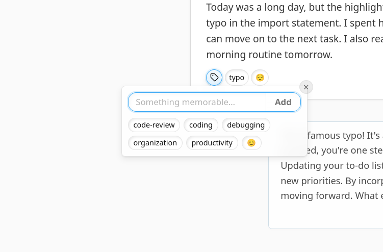
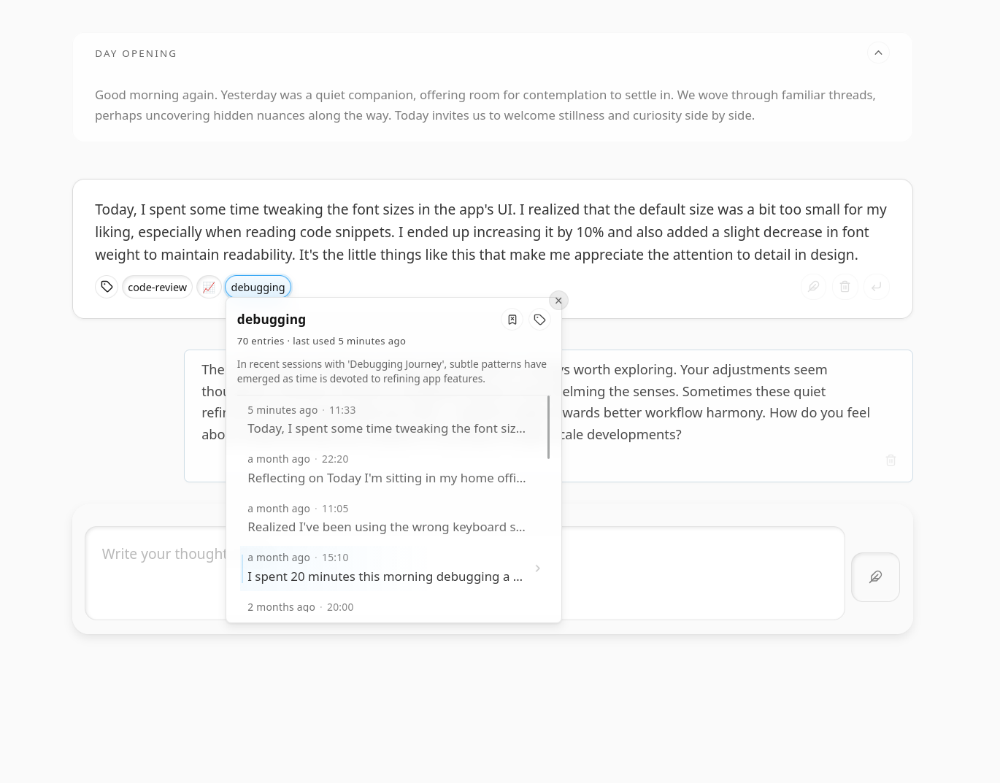
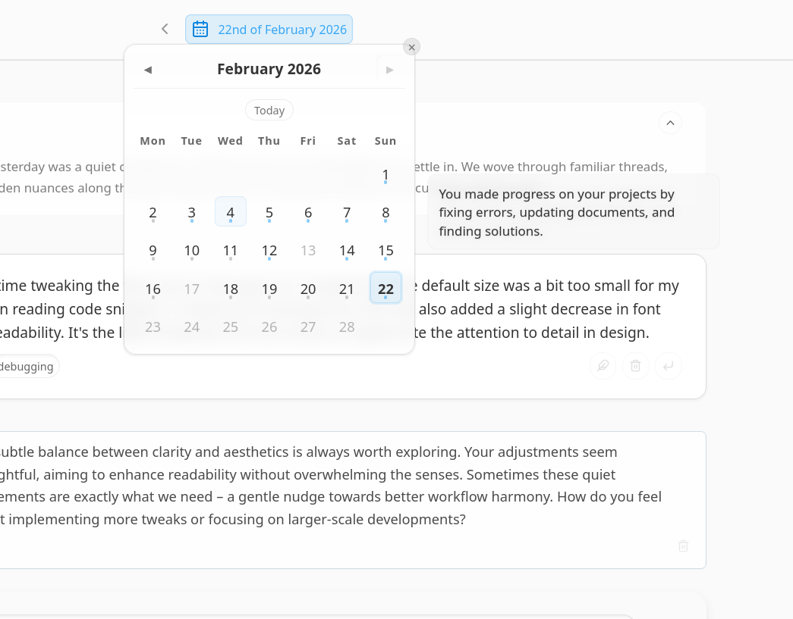

> Llamora is an experimental, local-first journaling environment that attempts to make continuity visible.
>
> You write in daily pages. The system helps you move through what accumulates over time, with lightweight structure and recall views that make it easier to notice threads you would otherwise miss. A model running on your own machine is part of that flow, producing day openings, tag recaps, and reflective responses inside the journal itself.
>
> Llamora is not designed to be a chat wrapper. It is an attempt to treat a journal as a navigable archive, built around time and return, rather than a stream of disconnected entries.

---

## What It Does

**Daily pages.** A new page opens each day. You write; the model responds inline if you want it to (and only then). This exchange is stored as a persistent log that accumulates over time.

**Day openings.** At the start of each day, the model generates a short opening. It draws on a rolling window of recent entries and a digest of the previous day's exchange, and becomes the first message on the new page.

**Traces.** After each exchange, the model suggests relevant tags. These tags (called traces in the app) accumulate in a dedicated view showing frequency over time, co-occurrence with other traces, chronological entry history, and a model-generated summary of what the trace represents. An activity heatmap shows usage across the past year. Tags also allow you to attach context for the model responses.

**Search.** Entries are embedded locally using a small sentence model. Search combines semantic nearest-neighbour retrieval with phrase matching and returns ranked results across the full log.

**Calendar.** All dates with entries are marked in a navigable calendar. Jumping to any date loads its page.

**Encryption.** All stored content (entries, model responses, embeddings, derived data) is encrypted at rest with a per-user key derived from your password and sealed with a recovery code.

---

## Screenshots













---

## Quick Start

**Requirements:** [uv](https://docs.astral.sh/uv/) and a running [llama.cpp](https://github.com/ggerganov/llama.cpp) server.

**1. Start a local model.**

```bash
llama-server \
  -hf bartowski/Meta-Llama-3.1-8B-Instruct-GGUF \
  -hff Meta-Llama-3.1-8B-Instruct-Q4_K_M.gguf \
  --port 8081 --jinja
```

Meta-Llama-3.1-8B-Instruct is the current baseline. The Q4_K_M quantisation (~5 GB) balances quality and memory footprint. The first invocation downloads the weights. The `--jinja` flag enables llama.cpp's internal chat-template rendering, which Llamora requires.

Any instruction-tuned model that follows system prompts reliably will work. The [bartowski recommended small models](https://huggingface.co/collections/bartowski/recommended-small-models) collection is a useful starting point for alternatives.

**2. Install dependencies.**

```bash
uv sync
```

**3. Start the server.**

```bash
LLAMORA_LLM__UPSTREAM__HOST=http://127.0.0.1:8081 uv run llamora-server dev
```

Open [http://localhost:5000](http://localhost:5000). On first run, register an account — the database is created automatically.

The first time search is used, a small sentence embedding model (~130 MB) is downloaded and cached locally.

---

## Conceptual Notes

Llamora is organised around time, not conversation. The primary navigation is a calendar. You write entries inside a daily page.

Many AI interfaces are organised around an ongoing back-and-forth. The conversation grows as a continuous thread. In Llamora, entries are anchored to a date. You add text to a day. The model may respond, but those responses sit inside the same page. The day contains the exchange rather than the exchange defining the structure.

The model is part of that daily flow. It opens each day, can respond to entries, and suggests traces that describe the exchange. Those suggestions are optional. When kept, they become part of the archive rather than temporary output. Over time, both your writing and the model’s contributions accumulate in the same log.

Traces are lightweight labels proposed by the model to make later return easier. When added, they allow you to see where something recurs, what it tends to appear alongside, and which entries it touches. The aim is not interpretation, but legibility.

A diary is a personal, private artifact with strong security expectations. You do not expect it to send data elsewhere, depend on a remote service, or expose its contents by default. Llamora follows those constraints. The model runs on your machine, and the archive remains there.

The system does not attempt to evaluate you. The model can respond and suggest traces, but it does not score entries, infer traits, or generate behavioural profiles. Nothing is surfaced as an assessment. The record is yours to interpret.

---

## System Properties

- **No network access required.** All inference, embedding, and storage happens locally.
- **No telemetry.** The application makes no outbound requests.
- **Streamed responses.** Model output is delivered via server-sent events and appears incrementally as it is generated.
- **Encryption at rest.** All content is encrypted with a per-user Data Encryption Key (DEK) wrapped by your password. A recovery code provides a second unwrap path. Loss of both means the data cannot be recovered by anyone.
- **Embeddings are local.** The sentence model runs on your machine. Embeddings are stored in encrypted form alongside the rest of the data.
- **SQLite-backed.** All persistent state is a single file. Migrations are applied automatically at startup.
- **Single-user.** Multi-user and administrative interfaces are not implemented.

---

## Stack

**Backend:** Async Python ([Quart](https://quart.palletsprojects.com/)) with server-sent events for response streaming. Configuration via [Dynaconf](https://www.dynaconf.com/). Package management via [uv](https://docs.astral.sh/uv/).

**Frontend:** [HTMX](https://htmx.org/) with server-rendered HTML fragments. No JavaScript framework. Native ES modules in development; [esbuild](https://esbuild.github.io/) for production bundles (vendored binary, driven by Python). Formatting and linting via [Biome](https://biomejs.dev/).

**Storage:** SQLite. Single-file database, no ORM. Schema managed with lightweight incremental migrations.

**Encryption:** [libsodium](https://doc.libsodium.org/) (via PyNaCl). Per-user symmetric key (DEK) wrapped by a password-derived key and a separate recovery code.

**Inference:** Any [OpenAI-compatible](https://platform.openai.com/docs/api-reference/chat) `/v1/chat/completions` endpoint — in practice, [llama.cpp](https://github.com/ggerganov/llama.cpp) running locally. The client is the OpenAI Python SDK pointed at `127.0.0.1`.

**Embeddings:** [FlagEmbedding](https://huggingface.co/BAAI/bge-small-en-v1.5) (bge-small-en-v1.5) for local sentence embeddings. [HNSWlib](https://github.com/nmslib/hnswlib) for approximate nearest-neighbour retrieval.

**Key design decisions:**

- *Server-rendered HTML over an SPA.* The server is the source of truth for all state. HTMX handles partial updates and navigation; the client manages transitions and feedback only. This keeps the frontend auditable and avoids a separate API layer.
- *OpenAI-compatible abstraction.* Llamora is not tied to a specific model or runtime. Any locally running server that speaks `/v1/chat/completions` works. Swapping models requires no code changes.
- *SQLite + per-user encryption.* No external database, no cloud dependency. The entire journal is a single file. Encryption happens at the application layer before writes.
- *SSE for streaming.* Model output is pushed to the browser incrementally via server-sent events as it is generated, without polling or websockets.

---

## Configuration

Values are read in order: built-in defaults → `config/settings.local.toml` → `.env` → environment variables.
Environment variables use double-underscore separators to represent nesting:

```
LLAMORA_LLM__UPSTREAM__HOST=http://127.0.0.1:8081
LLAMORA_LLM__CHAT__MODEL=local
LLAMORA_APP__PORT=5050
```

`config/settings.local.toml` is the preferred method for persistent local overrides:

```toml
[default.LLM.upstream]
host = "http://127.0.0.1:8081"

[default.LLM.chat]
model = "local"

[default.LLM.generation]
temperature = 0.7
top_p = 0.8
```

llama.cpp-specific parameters (such as `top_k` or `mirostat`) can be passed through via `LLM.chat.parameters`, but only keys listed in `LLM.chat.parameter_allowlist` are forwarded to the upstream. This prevents accidental leakage of unknown parameters.

| Section             | Purpose                              |
| ------------------- | ------------------------------------ |
| `APP`               | Host, port, runtime                  |
| `FEATURES`          | Toggle optional functionality        |
| `AUTH`              | Login limits and timeouts            |
| `DATABASE`          | SQLite path and pool                 |
| `LLM.chat`          | Chat client and parameter settings   |
| `LLM.upstream`      | Upstream connection                  |
| `LLM.generation`    | Default generation parameters        |
| `LLM.tokenizer`     | Token counting and safety margin     |
| `SEARCH`            | Semantic search and ANN limits       |
| `CRYPTO`            | DEK storage method                   |
| `COOKIES`           | Cookie name and encryption secret    |

**Prompt templates** are Jinja2 files in `src/llamora/llm/templates`.
The three active templates are `system.txt.j2`, `opening_system.txt.j2`, and `opening_recap.txt.j2`.
Editing them does not require touching Python. Changes take effect on restart.

To point Llamora at a different template directory, set `LLAMORA_PROMPTS__TEMPLATE_DIR`.

---

## Development

```bash
# Install
uv sync

# Run with live reload
uv run llamora-server dev

# Run for production
uv run llamora-server --workers 4

# Type check
uv run pyright

# Backend lint and format
uv run ruff check
uv run ruff format

# Frontend lint and format
biome check
biome format --write
```

Set `QUART_DEBUG=1` to enable Quart's debug output. Append `--no-reload` to `dev` to disable the file watcher.

**Frontend assets** are served as native ES modules in development and can be bundled for production:

```bash
uv run python scripts/build_assets.py build --mode prod
```

When `frontend/dist/manifest.json` exists the server uses bundled outputs. Remove `frontend/dist/` to revert to unbundled files.

**Vendored JS dependencies** are committed under `frontend/static/js/vendor/` and can be regenerated:

```bash
pnpm install && pnpm vendor
```

**Git hooks** are in `.githooks/`:

```bash
git config core.hooksPath .githooks
```

The pre-commit hook formats and checks staged Python files with Ruff before each commit.

**Migrations** are applied automatically at startup. To inspect or apply manually:

```bash
uv run python scripts/migrate.py status
uv run python scripts/migrate.py up
```

---

## Limitations

- No two-factor authentication (e.g. WebAuth) or captcha protection yet.
- Designed for single-user, local use.
- Requires a locally running model server. Inference speed depends on available hardware; a dedicated GPU makes a significant difference.
- Model weights are several gigabytes and are downloaded by llama.cpp on first use. The sentence embedding model is downloaded separately.
- Output quality is directly determined by the local model. A model that does not follow instructions reliably will produce poor responses, traces, openings, and summaries.
- Loss of both password and recovery code makes stored data unrecoverable.
- No content moderation or prompt filtering. Local, personal use is assumed.
- Not production-ready. Deploying outside a personal context is not recommended.
