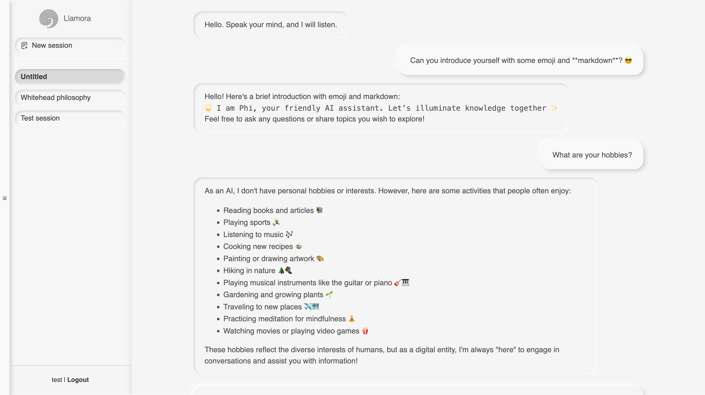
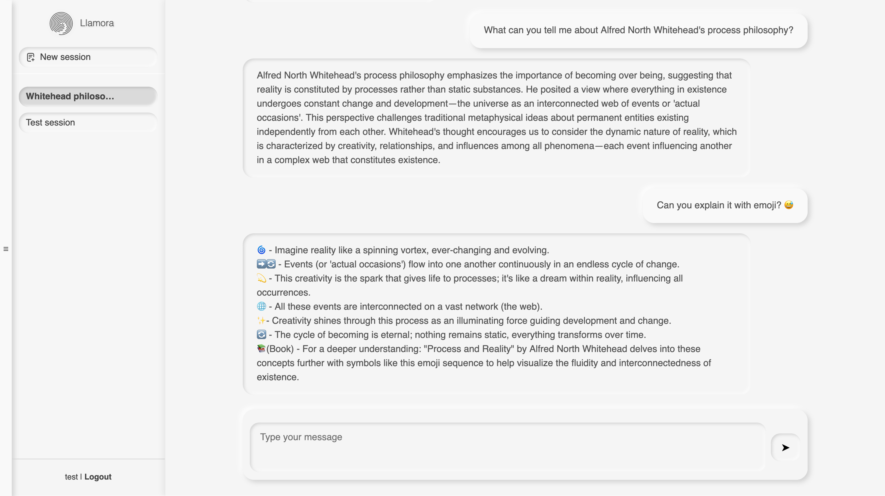
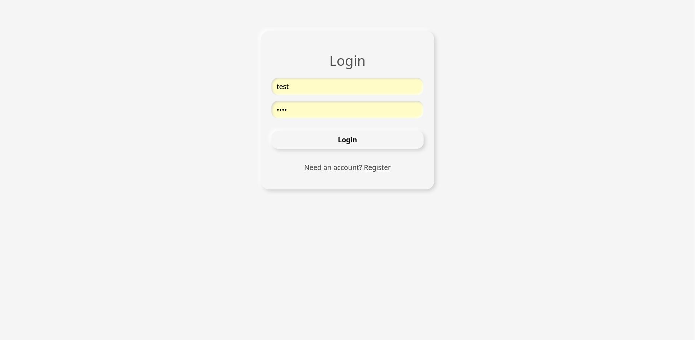
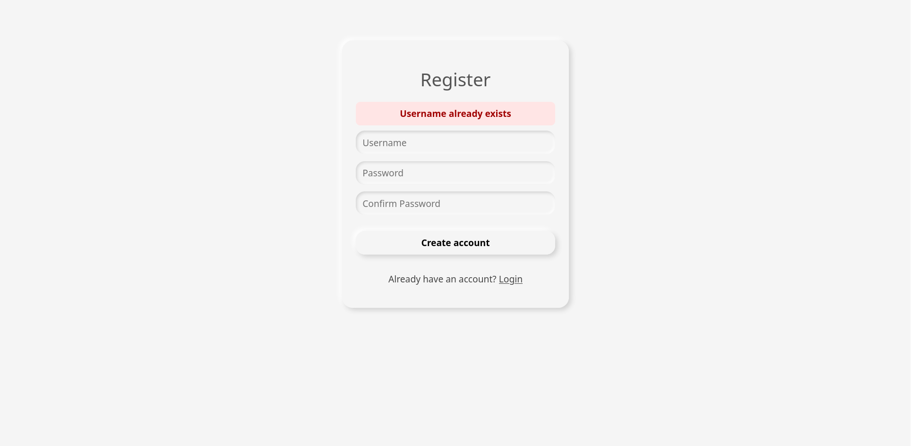

❗ **This project is a personal learning experiment. It is not production-ready. Do not deploy this without major modifications. It’s meant for educational use only.**

# Llamora

> “The unseen current of thought.”


### Screenshots





---

## Features

- **Local LLM Backend** Runs a llama.cpp model locally via [**llama-cpp-python**](https://github.com/abetlen/llama-cpp-python), using [LangChain](https://www.langchain.com/) to manage prompts. No cloud or API keys needed -- your data and queries stay on your machine. You just provide a GGUF model file, and the app will load it at startup.

- **Streaming Responses** Utilizes **Server-Sent Events (SSE)** to stream the AI's response token by token. The user sees the answer appear as it's being generated, similar to ChatGPT's interface.

- **HTMX-Powered UI** Leverages [**HTMX**](https://htmx.org/) for dynamic content updates without writing custom JS for every interaction. For example:

  - Creating a new chat session, switching between sessions, and deleting sessions all happen via HTMX requests that swap in new HTML fragments.
  - This approach means **no SPA framework** is needed, the server renders HTML partials which are inserted into the page. It's simple and keeps front-end code to a minimum.

- **Multi-Session Chat** Supports multiple chat sessions per user. Users can have several conversations (sessions) with the assistant and switch between them. Each session's message history is stored in a local SQLite database and retrieved when you revisit that session. You can create new sessions (they start blank with a greeting), rename sessions, or delete sessions.

- **User Accounts**  Includes a basic username/password authentication system:

  - Users can register and login. Passwords are stored securely (hashed with Argon2id + salt).
  - Logged-in users can only access their own chat sessions and data (isolated per account).
  - The app uses encrypted cookies to keep users logged in without server-side sessions. (Cookies are encrypted with a secret key so they can't be tampered with.)

- **Zero-Knowledge Message Encryption** Each user gets a random 32-byte Data Encryption Key (DEK) that is wrapped with Argon2id using both their password and the recovery code. Messages are encrypted and can only be decrypted with either secret. Resetting a password re-wraps the existing DEK without touching stored ciphertexts.

- **Neumorphic UI Design** The interface has a clean, modern look with soft shadows. There's virtually no JavaScript in the frontend beyond handling the streamed messages and some minor UX tweaks (like auto-scrolling the chat window).

- **Markdown Support** The assistant's responses can include Markdown formatting. The client will render Markdown into HTML (for example, **bold text**, *italics*, `code blocks`, lists, etc.). The app uses **Marked** (Markdown parser) and **DOMPurify** (to sanitize output) on the client side to render any Markdown content from the LLM.

- **Lightweight and Dependency-Minimal** The entire app is relatively small in terms of code. It uses a few Python packages (Quart, NaCl for security, LangChain for llama.cpp integration) and some JS libraries (HTMX and extensions, Marked, DOMPurify), all of which are either included or installable via [uv](https://docs.astral.sh/uv/). There is no need for Node.js build steps, no bundlers, and no heavy frameworks.

## Known Limitations

This project has **several limitations** by design. It's important to understand them if you plan to use or extend this code:

- **Not Scalable (Single-User Queue):** The app can only comfortably handle one chat interaction at a time. The LLM processing is single-threaded and queued. If two users ask questions simultaneously, one will wait until the other's response is done. This is fine for a personal assistant or small demo, but not for a multi-user or high-traffic scenario. Scaling would require architectural changes (e.g., running the model in a separate service or adding task workers).

- **No API or External Interface:** The app doesn't expose an API for programmatic access, it's purely a web interface. That's fine for interactive use, but if you wanted to use this as a backend service, you'd have to add JSON endpoints or similar.

- **Auth is Basic:** The authentication system is very simple:

  - Password reset requires the recovery code and there's no email verification.
  - No account deletion or profile management.
  - No multi-factor auth.
  - No OAuth or other single-sign on method
  - Very weak constraints on passwords.
  - All users are equal (no roles or admin). It serves the purpose of protecting your chat data from others on a shared deployment, but it's not meant for a large user base without enhancements.

- **Input/Output Filtering:** Aside from Markdown sanitization, there's no content filtering on user inputs or AI outputs. The model could potentially produce inappropriate content if prompted. There is also nothing preventing prompt injections (where a user could ask the assistant to ignore its system prompt). Since this is a closed environment (local model, one user), that wasn't a focus. But it's something to consider if expanded; e.g., using moderation models or guardrails if it were public.

- **Model and Performance:** The app loads the model into RAM when it starts. Large models (even quantized) can be slow or consume a lot of memory. The example model (Phi 3.5 mini) is relatively small, but anything larger might make the app sluggish or not fit in memory depending on your hardware. There's no mechanism to swap models on the fly; it's a static single model. Also, generation parameters (temperature, max tokens) are hardcoded in the LLMEngine. You'd have to modify code to adjust those.

---

## Running the App

### Requirements

- [uv](https://docs.astral.sh/uv/)
- a compatible GGUF LLM model (e.g. Phi-3.5)
- a relatively fast computer (ideally with a strong GPU)
- C/C++ Build Tools:  Needed to install `llama-cpp-python` (which compiles the llama.cpp C++ library). On Linux, ensure you have `cmake`, `g++`, etc. installed.

### Run
Download [Phi-3.5-mini-instruct-GGUF](https://huggingface.co/MaziyarPanahi/Phi-3.5-mini-instruct-GGUF) (tested with the [Q5_K_M](https://huggingface.co/MaziyarPanahi/Phi-3.5-mini-instruct-GGUF/blob/main/Phi-3.5-mini-instruct.Q5_K_M.gguf) quantization).
Set the `CHAT_MODEL_GGUF` environment variable to the full path of the `.gguf` file. Or edit the `.env` file to include: `CHAT_MODEL_GGUF=/path/to/your/model.gguf`

Install [uv](https://docs.astral.sh/uv/#installation). Then run:

```bash
uv run quart --app main run
```

Set `QUART_DEBUG=1` for automatic reloading on code changes.

For CUDA support (Nvidia GPU) you must reinstall the [llama-cpp-python](https://github.com/inference-sh/llama-cpp-python) library (and have the CUDA toolkit installed):

``` bash
CMAKE_ARGS="\
 -DGGML_CUDA=on \
 -DLLAMA_BUILD_TESTS=OFF \
 -DLLAMA_BUILD_EXAMPLES=OFF \
 -DLLAMA_BUILD_TOOLS=OFF \
uv add --force-reinstall --no-cache-dir llama-cpp-python
```
