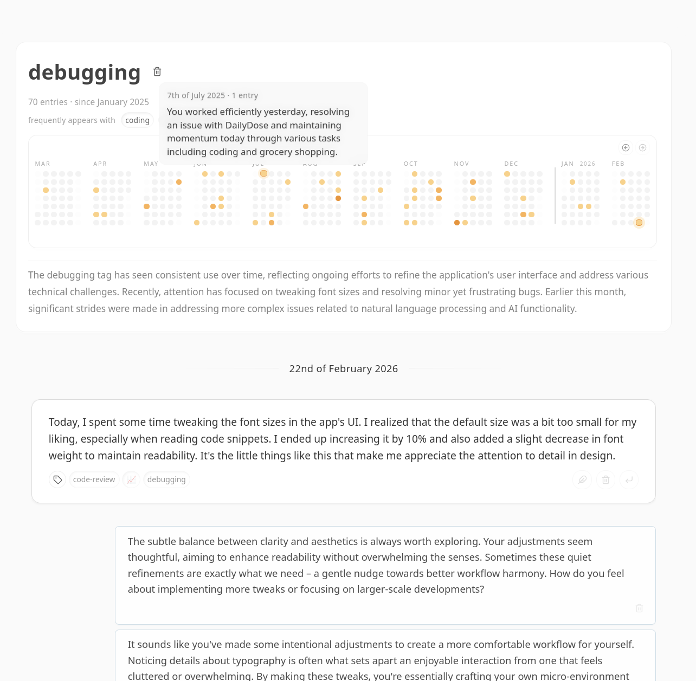

# Llamora

> Llamora is an experimental, local-first journaling environment that attempts to make continuity visible.
>
> You write in daily pages.
> Over time, those pages accumulate into timelines, tag views, and summaries.
> A locally running model participates in this process — generating day openings, tag recaps, and reflective responses — as part of the structure of the system.
>
> It runs entirely on your machine.
>
> Llamora is not a chat wrapper.
> It is an attempt to build a longitudinal writing interface where time, repetition, and reflection are first-class.

---

## What It Does

**Daily pages.** A new page opens each day. You write; the model responds inline. The exchange — your entries and the model's replies — is stored as a persistent log that accumulates over time.

**Day openings.** At the start of each day, the model generates a short opening. It draws on a rolling window of recent entries and a digest of the previous day's exchange, and becomes the first message on the new page.

**Traces.** After each exchange, the model tags the entry with hashtags and an emoji. These tags — called traces — accumulate in a dedicated view showing frequency over time, co-occurrence with other traces, chronological entry history, and a model-generated summary of what the trace represents. An activity heatmap shows usage across the past year.

**Search.** Entries are embedded locally using a small sentence model. Search combines semantic nearest-neighbour retrieval with phrase matching and returns ranked results across the full log.

**Calendar.** All dates with entries are marked in a navigable calendar. Jumping to any date loads its page.

**Encryption.** All stored content — entries, model responses, embeddings, derived data — is encrypted at rest with a per-user key derived from your password and sealed with a recovery code.

---

## Screenshots





---

## Quick Start

**Requirements:** [uv](https://docs.astral.sh/uv/) and a running [llama.cpp](https://github.com/ggerganov/llama.cpp) server.

**1. Start a local model.**

```bash
llama-server -hf Qwen/Qwen3-4B-Instruct-2507 --port 8081 --jinja
```

Qwen3-4B-Instruct is the baseline model: it follows instructions reliably and fits on consumer hardware. The first invocation downloads the weights (~2.5 GB in default quantisation). The `--jinja` flag enables llama.cpp's internal chat-template rendering, which Llamora requires.

**2. Install dependencies.**

```bash
uv sync
```

**3. Start the server.**

```bash
LLAMORA_LLM__UPSTREAM__HOST=http://127.0.0.1:8081 uv run llamora-server dev
```

Open [http://localhost:5000](http://localhost:5000). On first run, register an account — the database is created automatically and the registration page is shown until at least one user exists.

The first time search is used, a small sentence embedding model (~130 MB) is downloaded and cached locally.

---

## Conceptual Notes

Llamora is organised around time, not conversation.
The primary navigation is a calendar. The primary unit is a daily page.

In most writing tools, AI is something you invoke.
In Llamora, the model participates in the structure of the day: it opens each page, responds to entries, tags the exchange, and later recaps what those tags represent.
These outputs enter the record — they are not session artifacts that disappear.
Over months, the model's contributions become part of the longitudinal shape of the log.

Traces are the mechanism for this.
Every exchange is tagged automatically by the model.
Those tags accumulate into views that show how often a theme recurs, what else it tends to appear alongside, and which entries it touches.
The intention is to make patterns in your own writing legible without requiring you to curate them manually.

Local inference is not incidental.
A journal's value depends on candour, and candour depends on trust about where the record goes.
Running the model on your machine means nothing leaves it.

The system makes no attempt to evaluate your writing.
The model responds and tags; it does not score, surface behavioural insights, or summarise you.
The record is yours to interpret.

---

## System Properties

- **No network access required.** All inference, embedding, and storage happens locally.
- **No telemetry.** The application makes no outbound requests.
- **Streamed responses.** Model output is delivered via server-sent events and appears incrementally as it is generated.
- **Encryption at rest.** All content is encrypted with a per-user Data Encryption Key (DEK) wrapped by your password. A recovery code provides a second unwrap path. Loss of both means the data cannot be recovered by anyone.
- **Embeddings are local.** The sentence model runs on your machine. Embeddings are stored in encrypted form alongside the rest of the data.
- **SQLite-backed.** All persistent state is a single file. Migrations are applied automatically at startup.
- **Single-user.** Multi-user and administrative interfaces are not implemented.

---

## Configuration

Values are read in order: built-in defaults → `config/settings.local.toml` → `.env` → environment variables.
Environment variables use double-underscore separators to represent nesting:

```
LLAMORA_LLM__UPSTREAM__HOST=http://127.0.0.1:8081
LLAMORA_LLM__CHAT__MODEL=local
LLAMORA_APP__PORT=5050
```

`config/settings.local.toml` is the preferred method for persistent local overrides:

```toml
[default.LLM.upstream]
host = "http://127.0.0.1:8081"

[default.LLM.chat]
model = "local"

[default.LLM.generation]
temperature = 0.7
top_p = 0.8
```

llama.cpp-specific parameters (such as `top_k` or `mirostat`) can be passed through via `LLM.chat.parameters`, but only keys listed in `LLM.chat.parameter_allowlist` are forwarded to the upstream. This prevents accidental leakage of unknown parameters.

| Section             | Purpose                              |
| ------------------- | ------------------------------------ |
| `APP`               | Host, port, runtime                  |
| `FEATURES`          | Toggle optional functionality        |
| `AUTH`              | Login limits and timeouts            |
| `DATABASE`          | SQLite path and pool                 |
| `LLM.chat`          | Chat client and parameter settings   |
| `LLM.upstream`      | Upstream connection                  |
| `LLM.generation`    | Default generation parameters        |
| `LLM.tokenizer`     | Token counting and safety margin     |
| `SEARCH`            | Semantic search and ANN limits       |
| `CRYPTO`            | DEK storage method                   |
| `COOKIES`           | Cookie name and encryption secret    |

**Prompt templates** are Jinja2 files in `src/llamora/llm/templates`.
The three active templates are `system.txt.j2`, `opening_system.txt.j2`, and `opening_recap.txt.j2`.
Editing them does not require touching Python. Changes take effect on restart.

To point Llamora at a different template directory, set `LLAMORA_PROMPTS__TEMPLATE_DIR`.

---

## Development

```bash
# Install
uv sync

# Run with live reload
uv run llamora-server dev

# Run for production
uv run llamora-server --workers 4

# Type check
uv run pyright

# Backend lint and format
uv run ruff check
uv run ruff format

# Frontend lint and format
biome check
biome format --write
```

Set `QUART_DEBUG=1` to enable Quart's debug output. Append `--no-reload` to `dev` to disable the file watcher.

**Frontend assets** are served as native ES modules in development and can be bundled for production:

```bash
uv run python scripts/build_assets.py build --mode prod
```

When `frontend/dist/manifest.json` exists the server uses bundled outputs. Remove `frontend/dist/` to revert to unbundled files.

**Vendored JS dependencies** are committed under `frontend/static/js/vendor/` and can be regenerated:

```bash
pnpm install && pnpm vendor
```

**Git hooks** are in `.githooks/`:

```bash
git config core.hooksPath .githooks
```

The pre-commit hook formats and checks staged Python files with Ruff before each commit.

**Migrations** are applied automatically at startup. To inspect or apply manually:

```bash
uv run python scripts/migrate.py status
uv run python scripts/migrate.py up
```

---

## Limitations

- Designed for single-user, local use. There is no multi-user mode.
- Requires a locally running model server. Inference speed depends on available hardware; a dedicated GPU makes a significant difference.
- Model weights are several gigabytes and are downloaded by llama.cpp on first use. The sentence embedding model (~130 MB) is downloaded separately on first search.
- Output quality is directly determined by the local model. A model that does not follow instructions reliably will produce poor tags, openings, and summaries.
- Loss of both password and recovery code makes stored data unrecoverable.
- No content moderation or prompt filtering. Local, personal use is assumed.
- Not production-ready. Deploying outside a personal context is not recommended.
