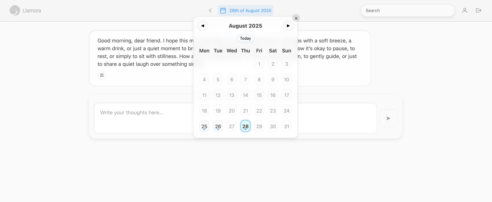
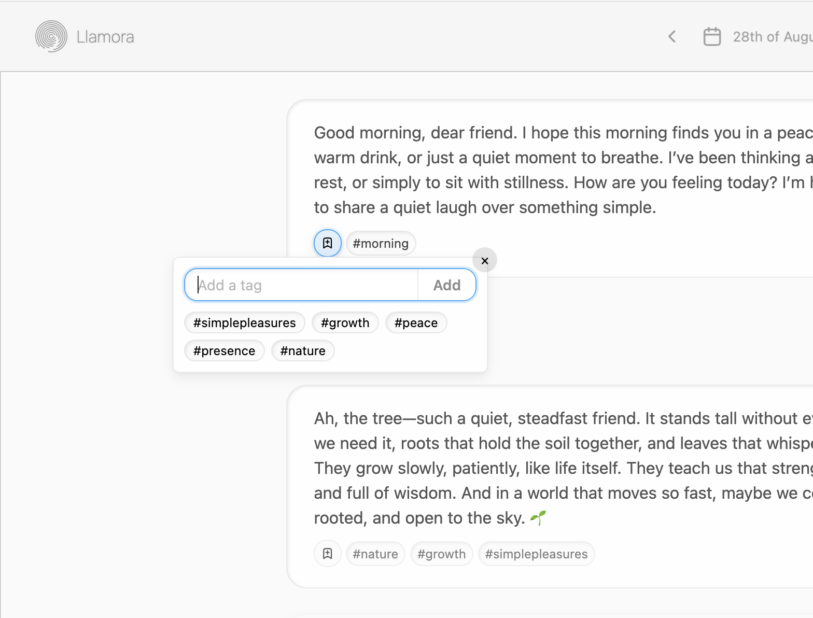

# Llamora

Llamora is an **experimental, local-first diary companion**.
It runs entirely offline.  No internet access, no API keys, no cloud, just your words on your own machine. Each day begins fresh at midnight, when the app gently opens a new page and offers a reflection on the day before.

It’s both a technical playground and a design experiment: a lightweight journaling companion powered by local LLMs, encryption, and a calm interface.

---

### Screenshots





---

## Features

- **Local LLM Backend** Runs a model locally using [**llama.cpp**](https://github.com/ggerganov/llama.cpp)'s `llama-server` (or Mozilla's [**llamafile**](https://github.com/Mozilla-Ocho/llamafile) if you prefer the single-binary workflow). No cloud or API keys are needed, and your data and queries stay on your machine. Point Llamora at a running server started with flags such as `llama-server --hf Qwen/Qwen3-4B-Instruct-2507 --port 8081` and the app will stream responses from it.

- **Streaming Responses** Utilizes **Server-Sent Events (SSE)** to stream the AI's response token by token. The user sees the answer appear as it's being generated, similar to ChatGPT's interface.

- **HTMX-Powered UI** Leverages [**HTMX**](https://htmx.org/) for dynamic content updates without writing custom JS for every interaction. This approach means **no SPA framework** is needed, the server renders HTML partials which are inserted into the page. It's simple and keeps front-end code to a minimum.

- **User Accounts**  Includes a basic username/password authentication system:

  - Users can register and login. Passwords are stored securely (hashed with Argon2id + salt).
  - Logged-in users can only access their own chat data (isolated per account).

- **Zero-Knowledge Message Encryption** Each user gets a random 32-byte Data Encryption Key (DEK) that is encrypted using both their password and the recovery code. Messages are encrypted and can only be decrypted with either secret. Resetting a password re-wraps the existing DEK without touching stored ciphertexts.

- **Neumorphic UI Design** The interface has a clean, modern look with soft shadows. There's virtually no JavaScript in the frontend beyond handling the streamed messages and some minor UX tweaks (like auto-scrolling the chat window).

- **Markdown Support** The assistant's responses can include Markdown formatting. The client will render Markdown into HTML (for example, **bold text**, *italics*, `code blocks`, lists, etc.). The app uses **Marked** (Markdown parser) and **DOMPurify** (to sanitize output) on the client side to render any Markdown content from the LLM.

- **Lightweight and Dependency-Minimal** The entire app is relatively small in terms of code. It uses a few Python packages (Quart, NaCl for security, fastembed for embeddings) and some JS libraries (HTMX and extensions, Marked, DOMPurify), all of which are either included or installable via [uv](https://docs.astral.sh/uv/). There is no need for Node.js build steps, no bundlers, and no heavy frameworks.

- **Privacy first search with ANN** The app includes a privacy-first search engine that runs entirely on your machine. Each message is embedded locally (e.g., with [FlagEmbedding](https://huggingface.co/BAAI/bge-small-en-v1.5)) and encrypted at rest, and decryption happens only in memory after login. Queries are answered by an in-memory [HNSW](https://github.com/nmslib/hnswlib) index (cosine over normalized embeddings) for fast semantic K-NN, warmed with recent items and progressively backfilled so results improve in place. On top of this, we perform fast exact/phrase matching (Aho-Corasick) and rank exact hits above purely semantic neighbors. There are some natural trade-offs: since the index lives in memory, RAM usage grows with the size of the chat history; large collections can take noticeable memory. And because exact matches are only surfaced if they also appear in the nearest-neighbor candidates, there is a small risk of false negatives: an exact string may exist but not be retrieved if it falls outside the top-K semantic hits.

- **Automatic tags & metadata** The system uses a hidden JSON object appended to every model reply (wrapped in `<meta>...</meta>` tags), generated under a strict grammar so it is always valid. This JSON carries metadata such as tags, emojis, or other annotations that remain invisible to the user but can be consumed by the application. By letting the model produce structured data alongside natural text, the interface could gain automatic tagging, search, and filtering.

## Known Limitations

This project has **several limitations** by design. It's important to understand them if you plan to use or extend this code:

- **Limited Scalability:** Llamora mirrors the llama.cpp/llamafile server's available parallel slots (configure via `LLAMORA_LLM__SERVER__PARALLEL`, set `parallel` under `[default.LLM.server]` in `settings.toml`, or use the server's `--parallel` flag). Without tuning this often means a single in-flight request. For heavy traffic, consider running multiple instances or a dedicated model service.

- **No API or External Interface:** The app doesn't expose an API for programmatic access, it's purely a web interface. That's fine for interactive use, but if you wanted to use this as a backend service, you'd have to add JSON endpoints or similar.

- **Auth is Basic:** The authentication system is very simple:

  - Password reset requires the recovery code and there's no email verification.
  - No multi-factor auth.
  - No captcha for registration or login.
  - No OAuth or other single-sign on method.
  - All users are equal (no roles or admin). It serves the purpose of protecting your chat data from others on a shared deployment, but it's not meant for a large user base without enhancements.

- **Input/Output Filtering:** Aside from Markdown sanitization, there's no content filtering on user inputs or AI outputs. The model could potentially produce inappropriate content if prompted. There is also nothing preventing prompt injections (where a user could ask the assistant to ignore its system prompt). Since this is a closed environment (local model, one user), that wasn't a focus. But it's something to consider if expanded; e.g., using moderation models or guardrails if it were public.

- **Model and Performance:** The app loads the model into RAM when it starts. Large models (even quantized) can be slow or consume a lot of memory. The example configuration targets [Qwen3-4B-Instruct](https://huggingface.co/Qwen/Qwen3-4B-Instruct-2507), but anything larger might make the app sluggish or not fit in memory depending on your hardware. There's no mechanism to swap models on the fly; it's a static single model. Generation parameters such as temperature or top-k can be provided via the client or overrides like ``LLAMORA_LLM__REQUEST__TEMPERATURE`` and ``LLAMORA_LLM__REQUEST__TOP_K``, while server settings like context window or GPU usage are set with keys such as ``LLAMORA_LLM__SERVER__ARGS__CTX_SIZE``. Set ``LLAMORA_LLM__SERVER__PARALLEL`` (or add ``parallel = N`` under ``[default.LLM.server]``) or the server's ``--parallel`` to control how many conversations can stream concurrently.
Pending responses are cancelled if the model takes longer than ``LLAMORA_LLM__STREAM__PENDING_TTL`` seconds (``pending_ttl`` under ``[default.LLM.stream]``) so long-running generations do not block new chats indefinitely.
Configuration is managed by [Dynaconf](https://www.dynaconf.com/); see
[`config/settings.toml`](./config/settings.toml) and
[`src/llamora/settings.py`](./src/llamora/settings.py) for details.

- **Data safety** If the user forgets both the password and the recovery token, all data is forever lost. This is by design, but it puts a heavy burden on the user and strays from the expected.

## Repository Layout

- `frontend/static/` holds the CSS, JavaScript, and image assets served by Quart.
- `src/llamora/app/templates/` contains Jinja templates and partials referenced by the front end.
- `config/` captures Dynaconf configuration that wires settings into the application at runtime.
---

## Running the App

### Requirements

- [uv](https://docs.astral.sh/uv/)
- a local [llama.cpp](https://github.com/ggerganov/llama.cpp) build (or prebuilt release) so you can run `llama-server --hf Qwen/Qwen3-4B-Instruct-2507`
- optionally, a [llamafile](https://github.com/Mozilla-Ocho/llamafile) binary if you prefer an all-in-one executable instead of running llama.cpp yourself
- a relatively fast computer (ideally with a strong GPU)
- A relatively modern browser

### Quick Start

1. Start a llama.cpp server in another terminal:

   ```bash
   llama-server -hf  unsloth/Qwen3-4B-Instruct-2507-GGUF:Q4_K_M --port 8081 --host 127.0.0.1
   ```

   This downloads the weights from Hugging Face on first launch and serves the HTTP API on `http://127.0.0.1:8081`. Adjust the host/port as needed. If you would rather run a self-contained executable, launch a llamafile with the same `--port` and point Llamora at it.

2. Point Llamora at the running server by setting the `LLAMORA_LLM__SERVER__HOST` environment variable (for example in your shell or `.env` file):

   ```bash
   export LLAMORA_LLM__SERVER__HOST=http://127.0.0.1:8081
   ```

   You can alternatively set `LLAMORA_LLM__SERVER__LLAMAFILE_PATH` if you prefer to let Llamora spawn a llamafile subprocess directly.

3. Start the web app:

   ```bash
   uv run llamora-server
   ```

   If the server starts correctly it will log something like `Running on http://127.0.0.1:5000`.

   - Set `QUART_DEBUG=1` for automatic reloading on code changes.
   - Set `LOG_LEVEL=DEBUG` for debug logging
   - Override the bind address with `LLAMORA_APP__HOST=0.0.0.0` or the port with `LLAMORA_APP__PORT=8000`.
     These values are loaded from Dynaconf when you start the bundled runner (`uv run llamora-server`
     or `uv run python -m llamora`). If you launch the app via `quart run`, use Quart's
     `--host` / `--port` flags instead because that entrypoint does not read Llamora's settings.

### A note on model selection
Qwen3-4B-Instruct has become the baseline for Llamora because it follows instructions reliably while still fitting on consumer hardware. Running it with llama.cpp is as simple as:

```
llama-server -hf  unsloth/Qwen3-4B-Instruct-2507-GGUF:Q4_K_M  --port 8081 --host 127.0.0.1
```

The default prompt template targets ChatML, so Qwen works out of the box. You may only need environment overrides for sampling preferences or context length tweaks:

```
LLAMORA_LLM__SERVER__HOST=http://127.0.0.1:8081 \
LLAMORA_COOKIES__SECRET="AAAAAAAAAAAAAAAAAAAAAAAAAAAAAAAAAAAAAAAAAAA=" \
QUART_DEBUG=1 \
uv run llamora-server
```

Each name mirrors the nested structure in [`config/settings.toml`](./config/settings.toml): double underscores split into sections (`LLAMORA_LLM__REQUEST__TEMPERATURE` maps to `settings.LLM.request.temperature`). Dynaconf reads `.env` automatically, so you can move those lines into an env file instead of inlining them. To persist overrides in TOML, edit `config/settings.local.toml` with tables that match the same hierarchy:

```toml
[default.LLM.server]
host = "http://127.0.0.1:8081"

[default.LLM.request]
temperature = 0.7
top_p = 0.8
top_k = 20
min_p = 0

[default.COOKIES]
secret = "AAAAAAAAAAAAAAAAAAAAAAAAAAAAAAAAAAAAAAAAAAA="
```

Restart the server after saving changes; Dynaconf merges `settings.local.toml`, `.secrets.toml`, `.env`, and process environment variables (prefixed with `LLAMORA_`), with the environment taking precedence last.

---

## Type checking

Use Pyright for static type checking. The configuration lives in `pyproject.toml`, so the standardized command is:

```bash
uv run pyright
```

---

### Deployment (not recommended)

Llamora is a personal experiment and **not production-ready**.
If you still deploy it, set the required secrets and runtime vars using the double-underscore format:

```bash
# Required
export LLAMORA_SECURITY__SECRET_KEY=$(openssl rand -hex 32)
export LLAMORA_COOKIES__SECRET=$(openssl rand -base64 32)

# Backend and runtime
export LLAMORA_LLM__SERVER__HOST=http://127.0.0.1:8081
export LLAMORA_DATABASE__PATH=data/llamora.sqlite3
export LLAMORA_CRYPTO__DEK_STORAGE=session
export LLAMORA_SESSION__TTL=604800
```

Optional overrides follow the same structure, e.g.:

```bash
export LLAMORA_LLM__REQUEST__TEMPERATURE=0.7
export LLAMORA_FEATURES__DISABLE_REGISTRATION=true
```

Then start:

```bash
uv run llamora-server
```

Use `.env` or `config/settings.local.toml` for persistent configuration.

❗ **This project is a personal learning experiment. It is not production-ready. Deploying this project as-is is discouraged. Use at your own risk.**
