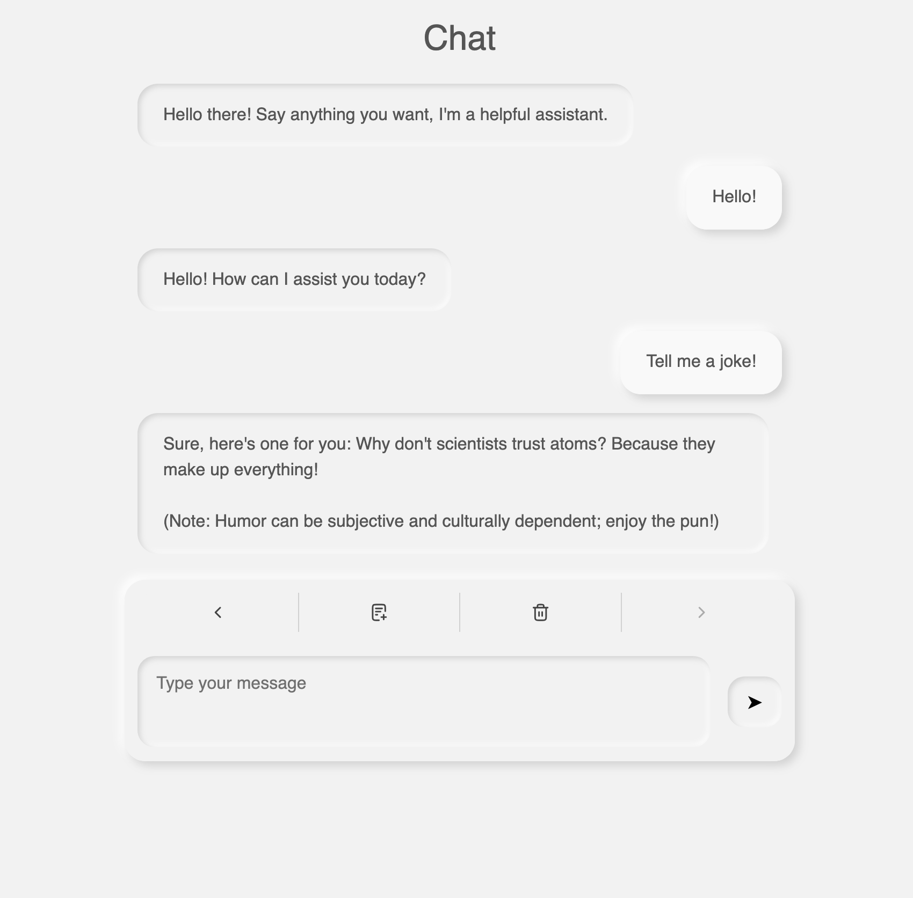

# Minimal chatbot
**A minimal Flask + HTMX + LangChain (with llama.cpp) interface for learning purposes only**

> ❗ **This project is a personal learning experiment. It is not production-ready. Do not deploy this without major modifications.**



---

## About

This project was built as a **hands-on experiment** in combining:

- 🧠 A local **LLM backend** (via [llama.cpp](https://github.com/ggml-org/llama.cpp) and [LangChain](https://www.langchain.com/)
- ⚡ **HTMX** for seamless front-end interactivity without JavaScript frameworks
- 🌐 **Flask** for backend routing and SSE streaming
- 💅 A **Neumorphic UI** for minimal styling

It’s a **prototype**, intended for exploring techniques like:

- Streaming LLM output over Server-Sent Events (SSE)
- Managing chat history by session
- Coordinating LLM calls with a safe in-process queue
- Building interactive web apps with minimal frontend JavaScript using [htmx](https://htmx.org/)

---

## ❌ Not for Production

**Please note:**

- There is **no authentication**
- Error handling is **minimal and cosmetic**
- The LLM call pipeline is **single-threaded and blocking**
- The design is optimized for learning, **not scalability**
- The security model is **nonexistent** (e.g., arbitrary input is accepted)

---

## Running the App

### Requirements

- [uv](https://docs.astral.sh/uv/)
- a compatible GGUF LLM model
- a relatively fast computer (ideally with a strong GPU)

### Run
Download [Phi-3.5-mini-instruct-GGUF](https://huggingface.co/MaziyarPanahi/Phi-3.5-mini-instruct-GGUF) (tested with the [Q5_K_M](https://huggingface.co/MaziyarPanahi/Phi-3.5-mini-instruct-GGUF/blob/main/Phi-3.5-mini-instruct.Q5_K_M.gguf) quantization).
Set the `CHAT_MODEL_GGUF`environment variable to the model path (or update the .env file).

Install [uv](https://docs.astral.sh/uv/#installation).

```bash
uv run flask --app main run
```

Set `FLASK_DEBUG=1` for automatic reloading on code changes.
