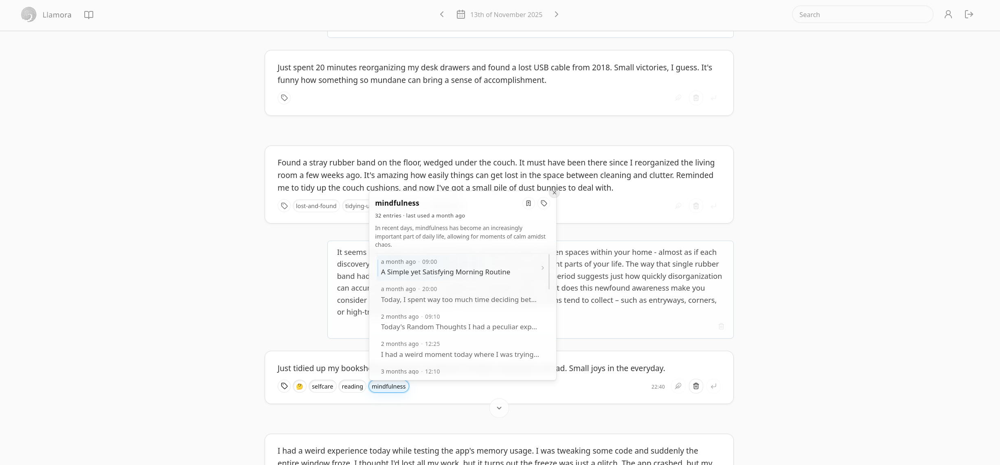
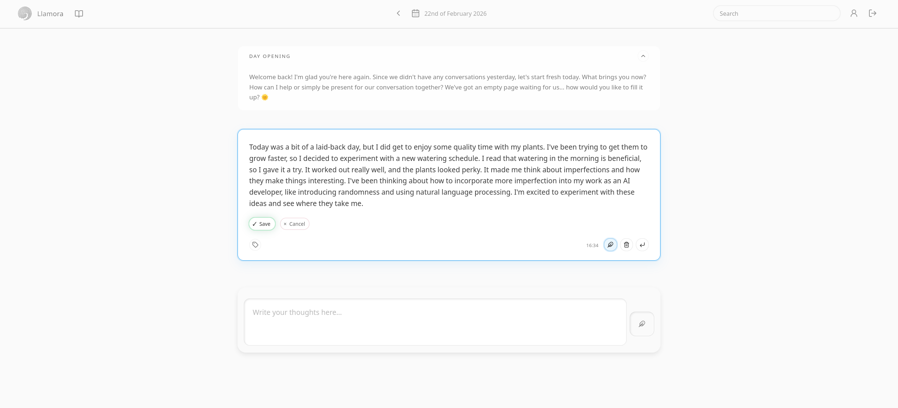
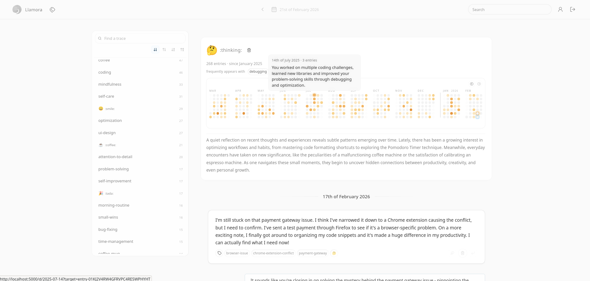
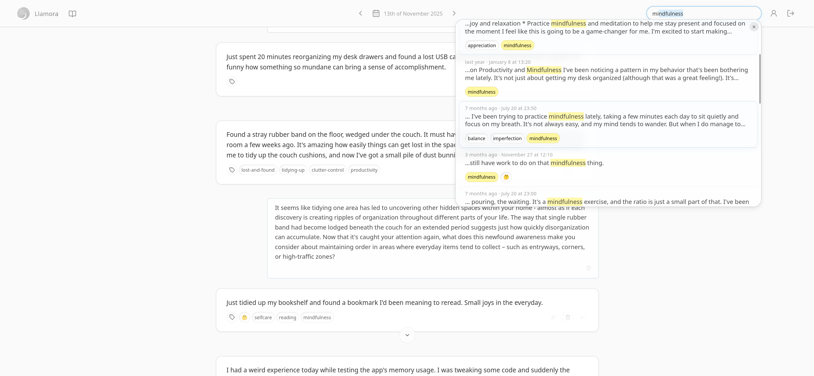
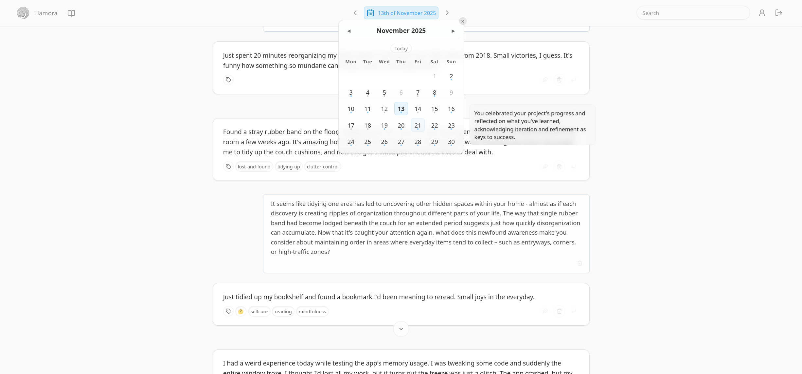
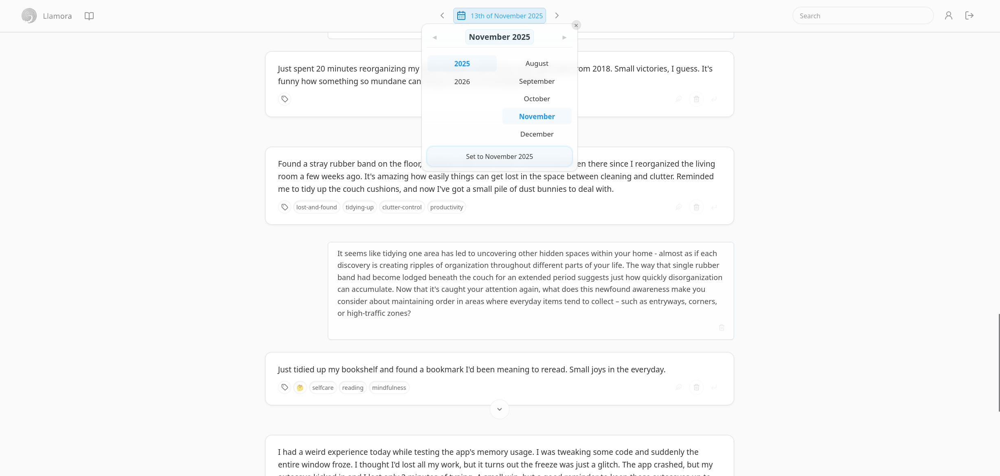
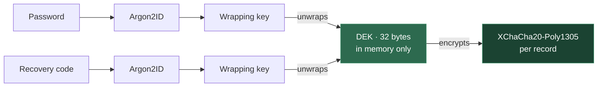

[](LICENSE)
[](https://www.python.org/)

> A local-first journaling environment that makes continuity visible.
> Write in daily pages. A model running on your machine produces day openings, recaps, and reflective responses.
> It's not a chat wrapper, but a navigable archive built around time and return.



---

## Table of Contents

- [Features](#features)
- [Screenshots](#screenshots)
- [Quick Start](#quick-start)
- [Try the Demo](#try-the-demo)
- [Design Philosophy](#design-philosophy)
- [Stack](#stack)
- [Configuration](#configuration)
- [Development](#development)
- [Production](#production)
- [Limitations](#limitations)

---

## Features

- **Daily pages** — a new page opens each day. You write; the model responds only when asked. The exchange becomes part of a persistent, date-anchored record.

- **Day openings** — the model generates a short opening each morning, drawing on recent entries and a digest of the previous day.

- **Traces** — after each exchange, the model suggests lightweight tags. Kept traces accumulate in a dedicated view: frequency over time, co-occurrence, chronological history, model-generated summaries, and a year-long activity heatmap. Attach traces as context for future responses.

- **Search** — find past entries by meaning, not just exact words. Search understands what you wrote about, not only how you phrased it, and returns ranked results across your entire journal.

- **Calendar navigation** — all dates with entries appear in a navigable calendar. Jump to any date to load its page.

- **Encryption at rest** — all stored content is encrypted before it reaches the database. Your password unwraps a per-user key that exists only in memory for the duration of the session — plaintext is never written to disk, session storage, or local storage. Entries, responses, embeddings, tags, and search queries are all covered.

- **Markdown and rich text** — entries and model responses are rendered as formatted text. Write naturally with headings, lists, emphasis, and links.

---

## Screenshots

<details>
<summary><strong>Diary view</strong> — daily page with entries and model responses</summary>


</details>

<details>
<summary><strong>Respond</strong> — model response detail</summary>


</details>

<details>
<summary><strong>Edit entries</strong></summary>



</details>

<details>
<summary><strong>Traces</strong> — tag overview with frequency and co-occurrence</summary>


</details>

<details>
<summary><strong>Search</strong> — semantic + phrase search across all entries</summary>



</details>

<details>
<summary><strong>Trace detail</strong> — history and summary for a single trace</summary>


</details>

<details>
<summary><strong>Trace popover</strong></summary>


</details>

<details>
<summary><strong>Calendar</strong></summary>




</details>

More screenshots in [`doc/screenshots/`](doc/screenshots/).

---

## Quick Start

**Requirements:** [uv](https://docs.astral.sh/uv/) and a running [llama.cpp](https://github.com/ggerganov/llama.cpp) server.

### 1. Start a local model

```bash
llama-server \
  -hf bartowski/Meta-Llama-3.1-8B-Instruct-GGUF:Q4_K_M \
  --port 8081 --jinja
```

The Q4_K_M quantisation (~5 GB) is the current baseline. Weights are downloaded on first run. The `--jinja` flag is required for chat-template rendering. Any instruction-tuned model works — see the [bartowski recommended small models](https://huggingface.co/collections/bartowski/recommended-small-models) for alternatives.

### 2. Install and run

```bash
uv sync
LLAMORA_LLM__UPSTREAM__HOST=http://127.0.0.1:8081 uv run llamora-server dev
```

Open [http://localhost:5000](http://localhost:5000) and register an account. The database is created automatically. The first search downloads a small embedding model (~130 MB).

---

## Try the Demo

A pre-generated database ships with the repo (`data/demo_data.sqlite3.lzma`) — simulated entries, responses, and traces from January 2025 to February 2026. This is the fastest way to explore the interface.

```bash
# Extract the demo database
uv run python scripts/extract_demo_db.py

# Start with demo data
LLAMORA_DATABASE__PATH=data/demo_data.sqlite3 \
LLAMORA_LLM__UPSTREAM__HOST=http://127.0.0.1:8081 \
uv run llamora-server dev
```

Log in with `demo_user` / `demo_user_test_password12345!`

---

## Design Philosophy

Llamora is organised around time, not conversation sessions. The primary navigation is a calendar. Entries are anchored to dates, not threads.

Many AI interfaces are built around an ongoing back-and-forth. Here, the model is part of a daily flow: it opens each day, can respond to entries, and suggests traces. Those suggestions are optional. When kept, they become part of the archive — not temporary output. Over time, both your writing and the model's contributions accumulate in the same log.

**Privacy is structural.** A diary is a personal artifact with strong security expectations. You don't expect it to send data elsewhere, depend on a remote service, or expose its contents by default. In Llamora, the model runs on your machine and the archive stays there, locked behind a key. The application makes no outbound requests — no telemetry, no analytics, no phoning home.

**No evaluation.** The model can respond and suggest traces, but it does not score entries, infer traits, or generate behavioural profiles. Nothing is surfaced as an assessment. The record is yours to interpret.

**Traces** are lightweight labels proposed by the model to make later return easier. They let you see where something recurs, what it tends to appear alongside, and which entries it touches.

---

## Stack

| Layer | Technology |
| --- | --- |
| **Backend** | Async Python ([Quart](https://quart.palletsprojects.com/)), SSE streaming, [Dynaconf](https://www.dynaconf.com/) config, [uv](https://docs.astral.sh/uv/), [Ruff](https://docs.astral.sh/ruff/) for lint/format |
| **Frontend** | [HTMX](https://htmx.org/) + server-rendered HTML fragments + [Web Components](https://developer.mozilla.org/en-US/docs/Web/API/Web_Components). No JS framework. [esbuild](https://esbuild.github.io/) for bundling. [Biome](https://biomejs.dev/) for lint/format |
| **Storage** | SQLite, no ORM, incremental migrations |
| **Encryption** | [libsodium](https://doc.libsodium.org/) via PyNaCl — per-user symmetric DEK, password-derived wrapping + recovery code |
| **Inference** | Any [OpenAI-compatible](https://platform.openai.com/docs/api-reference/chat) `/v1/chat/completions` endpoint (default: [llama.cpp](https://github.com/ggerganov/llama.cpp)) |
| **Embeddings** | [bge-small-en-v1.5](https://huggingface.co/BAAI/bge-small-en-v1.5) via FlagEmbedding + [HNSWlib](https://github.com/nmslib/hnswlib) ANN |

<details>
<summary><strong>Key design decisions</strong></summary>

- **Server-rendered HTML over an SPA.** The server is the source of truth. HTMX handles partial updates; the client manages transitions and feedback only. No separate API layer.
- **OpenAI-compatible abstraction.** Not tied to a specific model or runtime. Swapping models requires no code changes.
- **SQLite + per-user encryption.** No external database, no cloud dependency. The entire journal is a single file, encrypted at the application layer before writes.
- **SSE for streaming.** Model output is pushed incrementally without polling or websockets.

</details>

<details>
<summary><strong>Encryption design</strong></summary>

All content is encrypted at the application layer before it reaches the database. The server decrypts in memory to serve pages and run inference, but nothing is ever stored or logged in plaintext.

**Key hierarchy:**



- A random 32-byte **data-encryption key (DEK)** is generated at registration.
- The DEK is wrapped twice — once with the password, once with a recovery code — and only the wrapped forms are stored.
- At login the password unwraps the DEK into memory. It is held in an encrypted cookie or in session storage.
- Key material is zeroised on logout and session expiry.

**What is encrypted:**

| Data | Encrypted | Visible to server |
| --- | --- | --- |
| Entries & responses | XChaCha20-Poly1305 + AAD | Ciphertext, timestamps, role |
| Embeddings | XChaCha20-Poly1305 + AAD | Ciphertext only |
| Tag names | XChaCha20-Poly1305 + AAD | Deterministic hash (for grouping) |
| Search queries | XChaCha20-Poly1305 + AAD | Deterministic hash (for dedup) |
| Passwords | Argon2ID hash | Non-reversible hash |

Each record carries its own random nonce and authenticated additional data (AAD) binding it to the user and entry, preventing ciphertext reuse across contexts.

**Digests** — each entry stores an HMAC-SHA256 digest derived from the DEK, entry ID, role, and plaintext. The server can compare digests for caching and deduplication without decrypting content.

**DEK rotation** — when triggered, a new DEK is generated. The old DEK is chain-encrypted under the new one, and all stored data — including digests — is incrementally re-encrypted. The process is resumable if interrupted.

</details>

---

## Configuration

Values are read in order: built-in defaults → `config/settings.local.toml` → `.env` → environment variables.

Environment variables use double-underscore separators for nesting (e.g. `LLAMORA_LLM__UPSTREAM__HOST`).

`config/settings.local.toml` is preferred for persistent overrides:

```toml
[default.LLM.upstream]
host = "http://127.0.0.1:8081"

[default.LLM.chat]
model = "local"

[default.LLM.generation]
temperature = 0.7
top_p = 0.8
```

<details>
<summary><strong>Using an external API</strong> (OpenAI, etc.)</summary>

Llamora can connect to any hosted OpenAI-compatible endpoint. Set `base_url` and `api_key`, and enable `skip_health_check` to bypass the llama.cpp-specific probe:

```toml
[default.LLM.upstream]
skip_health_check = true

[default.LLM.chat]
base_url = "https://api.openai.com/v1"
model = "gpt-4o-mini"

[default.LLM.generation]
stop = []
```

Store the API key separately in `config/.secrets.toml` (not committed):

```toml
[default.LLM.chat]
api_key = "sk-..."
```

Or equivalently via environment variables:

```bash
LLAMORA_LLM__UPSTREAM__SKIP_HEALTH_CHECK=true \
LLAMORA_LLM__CHAT__BASE_URL=https://api.openai.com/v1 \
LLAMORA_LLM__CHAT__MODEL=gpt-4o-mini \
LLAMORA_LLM__CHAT__API_KEY=sk-... \
uv run llamora-server dev
```

Any OpenAI-compatible provider works — substitute `base_url`, `model`, and `api_key` as appropriate.

</details>

All available sections and their defaults are documented inline in [`config/settings.toml`](config/settings.toml). llama.cpp-specific parameters (`top_k`, `mirostat`, etc.) can be passed via `LLM.chat.parameters`, but only keys in `LLM.chat.parameter_allowlist` are forwarded upstream.

**Prompt templates** are Jinja2 files in `src/llamora/llm/templates` (`system.txt.j2`, `opening_system.txt.j2`, `opening_recap.txt.j2`). Edit them directly — no Python changes needed. Changes take effect on restart. Override the directory with `LLAMORA_PROMPTS__TEMPLATE_DIR`.

---

## Development

```bash
uv sync                                   # Install
uv run llamora-server dev                 # Run with live reload

uv run pyright                            # Type check
uv run ruff check && uv run ruff format   # Backend lint + format
biome check && biome format --write       # Frontend lint + format
```

Set `QUART_DEBUG=1` for Quart debug output. Add `--no-reload` to disable the file watcher.

**Frontend assets** — bundle the assets and watch for changes:

```bash
uv run python scripts/build_assets.py watch --mode dev
```

The server uses bundled outputs when `frontend/dist/manifest.json` exists. Remove `frontend/dist/` to revert.

**Vendored JS** — committed under `frontend/static/js/vendor/`, regenerated with:

```bash
pnpm install && pnpm vendor
```

**Git hooks** — enable with `git config core.hooksPath .githooks` (pre-commit runs Ruff on staged Python files and Biome on staged JS/CSS files).

**Migrations** — applied automatically at startup. Manual inspection:

```bash
uv run python scripts/migrate.py status
uv run python scripts/migrate.py up
```

---

## Production

> **Caveat:** Llamora should work with multiple users but this has not been extensively tested, and there is no two-factor authentication. Keep this in mind before exposing it beyond your local network.

### 1. Generate secrets

The shipped `SECRET_KEY` and `COOKIES.secret` are public defaults. Replace both before running outside development:

```bash
export LLAMORA_SECRET_KEY=$(openssl rand -base64 32)
export LLAMORA_COOKIES__SECRET=$(openssl rand -base64 32)
```

Or persist them in `config/.secrets.toml` (not committed):

```toml
[default]
SECRET_KEY = "..."

[default.COOKIES]
secret = "..."
```

### 2. DEK storage

By default the per-user data-encryption key (DEK) is held in an encrypted cookie. In production you can keep it server-side instead, so no key material leaves the server:

```toml
[default.CRYPTO]
dek_storage = "session"   # DEK stays in server memory; only a session ID is sent to the browser
```

The trade-off: sessions live in memory, so a server restart logs everyone out. With `--workers 1` this is fine; with multiple workers the setting is ignored and cookie mode is used automatically. For development, `cookie` (the default) is more convenient since logins survive restarts.

### 3. Build frontend assets

```bash
uv run python scripts/build_assets.py build --mode prod
```

### 4. Run

```bash
uv run llamora-server prod --workers 4
```

---

## Limitations

- No two-factor authentication or captcha protection.
- Multi-user should work but is not extensively tested. No admin interface.
- Requires a running model server. A dedicated GPU makes a significant difference for inference speed.
- Model weights are several GB, downloaded by llama.cpp on first use. The embedding model (~130 MB) is downloaded separately.
- Output quality depends entirely on the model. Unreliable instruction-following produces poor results.
- Loss of both password and recovery code makes stored data **unrecoverable**.
- No content moderation or prompt filtering — personal use is assumed.

---

## License

[GPL-3.0](LICENSE)
