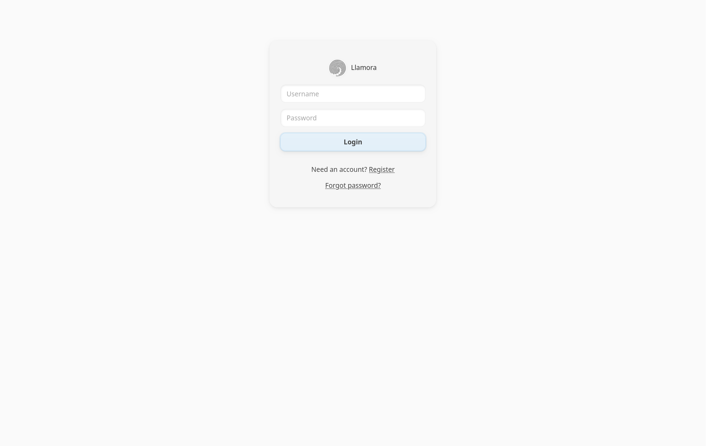

❗ **This project is a personal learning experiment. It is not production-ready. Do not deploy this without major modifications. It’s meant for educational use only.**

# Llamora

> “The unseen current of thought.”


### Screenshots



---

## Features

- **Local LLM Backend** Runs a model locally using [**llamafile**](https://github.com/Mozilla-Ocho/llamafile), a single-file executable that bundles an LLM and a small server. No cloud or API keys are needed, and your data and queries stay on your machine. You just provide a llamafile, and the app will load it at startup.

- **Streaming Responses** Utilizes **Server-Sent Events (SSE)** to stream the AI's response token by token. The user sees the answer appear as it's being generated, similar to ChatGPT's interface.

- **HTMX-Powered UI** Leverages [**HTMX**](https://htmx.org/) for dynamic content updates without writing custom JS for every interaction. For example:

  - Creating a new chat session, switching between sessions, and deleting sessions all happen via HTMX requests that swap in new HTML fragments.
  - This approach means **no SPA framework** is needed, the server renders HTML partials which are inserted into the page. It's simple and keeps front-end code to a minimum.

- **Multi-Session Chat** Supports multiple chat sessions per user. Users can have several conversations (sessions) with the assistant and switch between them. Each session's message history is stored in a local SQLite database and retrieved when you revisit that session. You can create new sessions (they start blank with a greeting), rename sessions, or delete sessions.

- **User Accounts**  Includes a basic username/password authentication system:

  - Users can register and login. Passwords are stored securely (hashed with Argon2id + salt).
  - Logged-in users can only access their own chat sessions and data (isolated per account).
  - The app uses encrypted cookies to keep users logged in without server-side sessions. (Cookies are encrypted with a secret key so they can't be tampered with.)

- **Zero-Knowledge Message Encryption** Each user gets a random 32-byte Data Encryption Key (DEK) that is wrapped with Argon2id using both their password and the recovery code. Messages are encrypted and can only be decrypted with either secret. Resetting a password re-wraps the existing DEK without touching stored ciphertexts.

- **Neumorphic UI Design** The interface has a clean, modern look with soft shadows. There's virtually no JavaScript in the frontend beyond handling the streamed messages and some minor UX tweaks (like auto-scrolling the chat window).

- **Markdown Support** The assistant's responses can include Markdown formatting. The client will render Markdown into HTML (for example, **bold text**, *italics*, `code blocks`, lists, etc.). The app uses **Marked** (Markdown parser) and **DOMPurify** (to sanitize output) on the client side to render any Markdown content from the LLM.

- **Lightweight and Dependency-Minimal** The entire app is relatively small in terms of code. It uses a few Python packages (Quart, NaCl for security, fastembed for embeddings) and some JS libraries (HTMX and extensions, Marked, DOMPurify), all of which are either included or installable via [uv](https://docs.astral.sh/uv/). There is no need for Node.js build steps, no bundlers, and no heavy frameworks.

- **Privacy first search with ANN** The app includes a privacy-first search engine that runs entirely on your machine. Each message is embedded locally (e.g., with [FlagEmbedding](https://huggingface.co/BAAI/bge-small-en-v1.5)) and encrypted at rest, and decryption happens only in memory after login. Queries are answered by an in-memory [HNSW](https://github.com/nmslib/hnswlib) index (cosine over normalized embeddings) for fast semantic K-NN, warmed with recent items and progressively backfilled so results improve in place. On top of this, we perform fast exact/phrase matching (Aho-Corasick) and rank exact hits above purely semantic neighbors. There are some natural trade-offs: since the index lives in memory, RAM usage grows with the size of the chat history; large collections can take noticeable memory. And because exact matches are only surfaced if they also appear in the nearest-neighbor candidates, there is a small risk of false negatives: an exact string may exist but not be retrieved if it falls outside the top-K semantic hits.

- **Automatic tags & metadata** The system uses a hidden JSON object appended to every model reply (following a sentinel token), generated under a strict grammar so it is always valid. This JSON carries metadata such as tags, emojis, or other annotations that remain invisible to the user but can be consumed by the application. By letting the model produce structured data alongside natural text, the interface could gain automatic tagging, search, and filtering.

## Known Limitations

This project has **several limitations** by design. It's important to understand them if you plan to use or extend this code:

- **Limited Scalability:** By default, Llamora processes requests with a single worker. For heavy traffic, consider running multiple instances or a dedicated model service.

- **No API or External Interface:** The app doesn't expose an API for programmatic access, it's purely a web interface. That's fine for interactive use, but if you wanted to use this as a backend service, you'd have to add JSON endpoints or similar.

- **Auth is Basic:** The authentication system is very simple:

  - Password reset requires the recovery code and there's no email verification.
  - No multi-factor auth.
  - No OAuth or other single-sign on method
  - All users are equal (no roles or admin). It serves the purpose of protecting your chat data from others on a shared deployment, but it's not meant for a large user base without enhancements.

- **Input/Output Filtering:** Aside from Markdown sanitization, there's no content filtering on user inputs or AI outputs. The model could potentially produce inappropriate content if prompted. There is also nothing preventing prompt injections (where a user could ask the assistant to ignore its system prompt). Since this is a closed environment (local model, one user), that wasn't a focus. But it's something to consider if expanded; e.g., using moderation models or guardrails if it were public.

- **Model and Performance:** The app loads the model into RAM when it starts. Large models (even quantized) can be slow or consume a lot of memory. The example model (Phi 3.5 mini) is relatively small, but anything larger might make the app sluggish or not fit in memory depending on your hardware. There's no mechanism to swap models on the fly; it's a static single model. Generation parameters such as temperature or top-k can be provided via the client or the ``LLAMORA_LLM_REQUEST`` environment variable, while server settings like context window or GPU usage are set with ``LLAMORA_LLAMA_ARGS``.
See [config.py](./config.py) for more details.

- **Data safety** If the user forgets both the password and the recovery token, all data is forever lost. This is by design, but it puts a heavy burden on the user and strays from the expected.
---

## Running the App

### Requirements

- [uv](https://docs.astral.sh/uv/)
- a [llamafile](https://github.com/Mozilla-Ocho/llamafile) model (e.g., [Phi-3.5-mini-instruct](https://huggingface.co/Mozilla/Phi-3-mini-4k-instruct-llamafile))
- a relatively fast computer (ideally with a strong GPU)
- A relatively modern browser

### Quick Start

1. Download a [Phi-3.5-mini-instruct](https://huggingface.co/microsoft/Phi-3.5-mini-instruct) [(download Q5_K_M)](https://huggingface.co/Mozilla/Phi-3-mini-4k-instruct-llamafile/resolve/main/Phi-3-mini-4k-instruct.Q5_K_M.llamafile) llamafile.
2. Set the `LLAMORA_LLAMAFILE` environment variable to the full path of the `.llamafile` file, or add a line like `LLAMORA_LLAMAFILE=/path/to/your/model.llamafile` to a `.env` file.
Alternatively set `LLAMORA_LLAMA_HOST` to the address of a running Llama file (e.g. `http://localhost:8080`); this bypasses the subprocess entirely and just talks to the API endpoint.

3. Start the server:

   ```bash
   uv run quart --app main run
   ```

   If the server starts correctly it will log something like `Running on http://127.0.0.1:5000`. The first time it will download an embedding model from HuggingFace, so first startup might be slow.

   - Set `QUART_DEBUG=1` for automatic reloading on code changes.
   - Set `LOG_LEVEL=DEBUG` for debug logging

### A note on model selection
While Phi 3.5 works sometimes, it is not great at instruction following and will often glitch. Personally I've had much better results with [Qwen 4B-Instruct](https://huggingface.co/Qwen) but no llamafile is readily available for download. You can download a [GUFF](https://huggingface.co/unsloth/Qwen3-4B-Instruct-2507-GGUF) from HuggingFace and convert it to a llamafile (e.g. `llamafile-convert Qwen3-4B-Instruct-2507-Q5_K_M.gguf`) provide you have [llamafile tools](https://github.com/Mozilla-Ocho/llamafile?tab=readme-ov-file#source-installation) installed.

Since Qwen uses a slightly different prompt format and sampling parameters you must adjust the settings. This is most easily done via the env vars.

```
LLAMORA_LLAMAFILE=<path to model>/Qwen3-4B-Instruct-2507-Q5_K_M.llamafile \
LLAMORA_PROMPT_FILE=llm/prompts/llamora_chatml.j2  \
LLAMORA_LLM_REQUEST='{"temperature": 0.7, "top_p": 0.8, "top_k": 20, "min_p": 0}' \
uv run quart --app main run
```

### Deployment (not recommended)

This project is an educational experiment and is **not** intended for production. If you still choose to deploy it, you must set several environment variables manually:

1. Generate secrets for the application and cookies:

   ```bash
   python3 - <<'PY'
   import secrets, base64
   print('LLAMORA_SECRET_KEY=' + secrets.token_urlsafe(32))
   print('LLAMORA_COOKIE_SECRET=' + base64.urlsafe_b64encode(secrets.token_bytes(32)).decode())
   PY
   ```

   Add the printed values to your environment. `LLAMORA_SECRET_KEY` is used by Quart. `LLAMORA_COOKIE_SECRET` must be a base64-encoded 32‑byte string for encrypted cookies. Without these keys the application is not secure. Keep these values somewhere safe.

2. Set the usual runtime variables such as:

   - `LLAMORA_LLAMAFILE` or `LLAMORA_LLAMA_HOST`
   - Optional overrides like `LLAMORA_LLAMA_ARGS`, `LLAMORA_LLM_REQUEST`, `LLAMORA_DB_PATH`, `LLAMORA_COOKIE_NAME`
   - `LLAMORA_DEK_STORAGE` chooses where the encryption key lives:
     - `cookie` (default) – survives server restarts but if an attacker gets both the cookie and `LLAMORA_COOKIE_SECRET` they can decrypt user data.
     - `session` – stores the key in server memory with an inactivity timeout (`LLAMORA_SESSION_TTL`), more secure but users must log in again after restarts and stale sessions are purged.
   - `LLAMORA_SESSION_TTL` to set session expiration in seconds (defaults to 604800)
   - `LLAMORA_EMBED_MODEL` to override the default embedding model name
   - `LLAMORA_DISABLE_REGISTRATION` set to a truthy value (e.g., `1`, `true`, `yes`) to hide registration and block `/register` (prints a one-time link if no users exist)
   - `LLAMORA_PROMPT_FILE` to point to a Jinja2 prompt template (defaults to `llm/prompts/llamora_phi.j2`)
   - `LLAMORA_GRAMMAR_FILE` to specify a grammar file (defaults to `llm/meta_grammar.bnf`)

Deploying this project as-is is discouraged. Use at your own risk.
