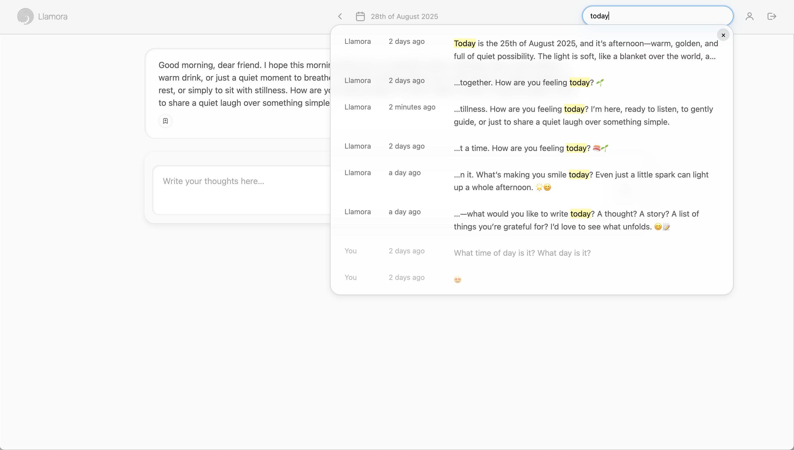

# Llamora

Llamora is an **experimental, local-first diary companion**.
It runs entirely offline: no API keys, no cloud, no telemetry.
Just your words, your thoughts, and a model that listens quietly on your own machine.

Each day begins fresh at midnight, when Llamora opens a new page and offers a short reflection on the day before.
You can write freely, think aloud, or stay in silence.

---

### Screenshots




---

## Features

* **Fully offline and private**
  Everything runs on your local device. No internet access is required, and your data never leaves your machine.

* **Daily pages**
  A new entry starts automatically each day, carrying a soft reflection from the previous one.

* **Streaming responses**
  Watch the model’s reply unfold word by word through the OpenAI-compatible streaming API.

* **HTMX-based UI**
  The interface updates dynamically without JavaScript frameworks. The backend renders HTML snippets directly, keeping the frontend light and responsive.

* **End-to-end encryption**
  Each user’s messages are encrypted with a unique Data Encryption Key (DEK), wrapped by their password and recovery code. Forget both, and the data remains sealed forever.

* **Local search with embeddings**
  Messages are embedded locally using [FlagEmbedding](https://huggingface.co/BAAI/bge-small-en-v1.5) and stored securely. Search combines fast semantic similarity (HNSWlib) with exact phrase matching to surface meaningful results—all offline.

* **Automatic tags and metadata**
  Each reply streams as plain text first, then a lightweight follow-up call adds an emoji and hashtags for search, filtering, and UI accents.

* **Markdown support**
  The interface renders formatted text safely through Marked + DOMPurify.

* **Minimal dependencies**
  The app uses Quart, NaCl, HTMX, and a few small Python libraries. Asset bundling relies on a vendored esbuild binary driven by Python.

---

## Getting Started

### Requirements

- [uv](https://docs.astral.sh/uv/)
- A local [llama.cpp](https://github.com/ggerganov/llama.cpp) build (or prebuilt release) so you can run `llama-server -hf Qwen/Qwen3-4B-Instruct-2507 --jinja`. Qwen3-4B-Instruct has become the baseline for Llamora because it follows instructions reliably while still fitting on consumer hardware.
- Optionally, a [llamafile](https://github.com/Mozilla-Ocho/llamafile) binary if you prefer an all-in-one executable instead of running llama.cpp yourself.
- A relatively fast computer (ideally with a strong GPU).
- A relatively modern browser.


### Set up a local model

   Llamora connects to an OpenAI-compatible API, typically provided by a local
   [**llama.cpp**](https://github.com/ggerganov/llama.cpp) or [**llamafile**](https://github.com/Mozilla-Ocho/llamafile) upstream.
   For example, if you have llama-cpp installed:

   ```bash
   llama-server -hf Qwen/Qwen3-4B-Instruct-2507 --port 8081 --jinja
   ```

   This downloads the model weights once and starts an HTTP endpoint at `http://127.0.0.1:8081`.
   The `--jinja` flag enables llama.cpp's internal chat-template rendering for
   OpenAI-compatible `messages` requests.
   Llamora connects through the OpenAI Python SDK using `LLM.chat.endpoint`
   (default `/v1/chat/completions`) and an optional `LLM.chat.base_url`.

### Create and activate a virtual environment

   ```bash
   uv sync
   source .venv/bin/activate
   ```

### Run Llamora

Development (Quart with live reload):

```bash
export LLAMORA_LLM__UPSTREAM__HOST=http://127.0.0.1:8081
export LLAMORA_LLM__CHAT__MODEL=local
uv run llamora-server dev
```

Production (Hypercorn with worker management):

```bash
export LLAMORA_LLM__UPSTREAM__HOST=http://127.0.0.1:8081
export LLAMORA_LLM__CHAT__MODEL=local
uv run llamora-server --workers 4 --graceful-timeout 30 --keep-alive 5
```

Both commands honor configuration overrides such as `LLAMORA_APP__HOST` and `LLAMORA_APP__PORT`, or you can pass `--host`/`--port` flags directly. Development keeps Quart’s code reloader enabled by default; append `--no-reload` to disable it. In production, tune `--workers` to match your CPU cores and use `--graceful-timeout`/`--keep-alive` to align with load balancers or process managers.

Open [http://localhost:5000](http://localhost:5000) (or your configured port) in your browser once the server starts.

### Front-end assets

Assets live under `frontend/static/` and can run directly as native ES modules or be bundled for production.
Use the vendored esbuild wrapper to produce minified bundles and a manifest in `frontend/dist/`:

```bash
uv run python scripts/build_assets.py build --mode prod
```

When `frontend/dist/manifest.json` exists, the server prefers the bundled outputs (exposed to templates as
`config.STATIC_MANIFEST`). Remove `frontend/dist/` to fallback to unbundled files, or run with `--mode dev`/`watch` during development.

---
## Privacy and Security

Llamora encrypts everything it stores.
Messages and derived values are encrypted with a per-user key that only your password or recovery code can unlock.
There are no analytics, external calls, or telemetry.
Even embeddings and indexes are decrypted only in memory after login.

---

## Configuration

Llamora’s configuration system is built on **Dynaconf**.
Values are read in layers: defaults → `settings.local.toml` → `.env` → environment variables.
Keys use double underscores to represent sections, for example:

```
LLAMORA_LLM__GENERATION__TEMPERATURE=0.7
LLAMORA_LLM__UPSTREAM__HOST=http://127.0.0.1:8081
LLAMORA_APP__PORT=5050
```

You can override any setting this way without editing the source.

A simplified version of the structure:

| Section       | Purpose                                            |
| ------------- | -------------------------------------------------- |
| `APP`         | Host, port, and runtime settings                   |
| `FEATURES`    | Toggle optional functionality such as registration |
| `AUTH`        | Login attempt limits and timeouts                  |
| `DATABASE`    | SQLite path and pool configuration                 |
| `LLM.chat`    | OpenAI-compatible chat client settings             |
| `LLM.upstream`  | Local upstream connection details (llama.cpp/llamafile) |
| `LLM.generation` | Default generation parameters                      |
| `LLM.tokenizer` | Token counting settings (tiktoken encoding + safety margin) |
| `SEARCH`      | Semantic search behavior and ANN limits            |
| `CRYPTO`      | DEK storage method (cookie or session)             |
| `COOKIES`     | Cookie name and encryption secret                  |

Local overrides can go into `config/settings.local.toml`, e.g.:

```toml
[default.LLM.upstream]
host = "http://127.0.0.1:8081"
parallel = 2

[default.LLM.chat]
model = "local"
parameter_allowlist = ["top_k", "mirostat", "mirostat_tau"]
parameters = { top_k = 40, mirostat = 2, mirostat_tau = 4.5 }

[default.LLM.generation]
temperature = 0.7
top_p = 0.8

[default.LLM.tokenizer]
encoding = "cl100k_base"

[default.LLM.tokenizer.safety_margin]
ratio = 0.1
min_tokens = 128
```

You can also pass llama.cpp-specific parameters through the OpenAI client by
adding them to `LLM.chat.parameters`, but only keys listed in
`LLM.chat.parameter_allowlist` will be forwarded.

Restart the app after changing settings.

### Prompt templates

System prompts are rendered from Jinja2 templates stored in `src/llamora/llm/templates`.
Each template exposes structured placeholders (context lines, vibe summaries, and recap data) so you can adjust copy without
touching Python code.

To point Llamora at a different set of prompt files, update `LLAMORA_PROMPTS__TEMPLATE_DIR` (or the matching entry in
`config/settings.toml`) to any directory containing replacements for:

* `system.txt.j2`
* `opening_system.txt.j2`
* `opening_recap.txt.j2`

Swap prompt variants by editing or replacing those files—changes take effect on the next server restart.

---

## Technical Overview

* **Backend:** Quart (async Python)
* **Frontend:** HTMX with server-rendered templates
* **Streaming:** OpenAI-compatible streaming responses
* **Database:** SQLite
* **Encryption:** libsodium / NaCl
* **Embeddings:** FlagEmbedding + HNSWlib
* **Configuration:** Dynaconf
* **Package Manager:** uv
* **LLM Client:** OpenAI Python SDK (pointed at a local upstream)

All code runs locally, and dependencies are minimal.
The system supports OpenAI-compatible llama.cpp endpoints and llamafile binaries through the same interface.

---

## Limitations

* Llamora is designed for single-user use.
* Large models may consume significant memory.
* There is no external API or multi-user admin interface.
* If you lose both password and recovery key, data cannot be recovered.
* No content moderation or prompt filtering (local use assumed).

---

## Development Notes

* Run with: `uv run llamora-server`
* Type check: `uv run pyright`
* Config lives in: `config/settings.toml` and `config/settings.local.toml`
* Debug mode: `QUART_DEBUG=1`


---

## Deployment (not recommended)

Llamora is a personal experiment and **not production-ready**.
If you still deploy it, set the required secrets and runtime vars.

```bash
# Required
export LLAMORA_SECRET_KEY=$(openssl rand -hex 32)
export LLAMORA_COOKIES__SECRET=$(openssl rand -base64 32)

# Backend and runtime
export LLAMORA_LLM__UPSTREAM__HOST=http://127.0.0.1:8081
export LLAMORA_DATABASE__PATH=data/llamora.sqlite3
export LLAMORA_CRYPTO__DEK_STORAGE=session
export LLAMORA_SESSION__TTL=604800
```

Optional overrides follow the same structure, e.g.:

```bash
export LLAMORA_FEATURES__DISABLE_REGISTRATION=true
```

Then start:

```bash
uv run llamora-server
```

Use `.env` or `config/settings.local.toml` for persistent configuration.

❗ **This project is a personal learning experiment. It is not production-ready. Deploying this project as-is is discouraged. Use at your own risk.**
